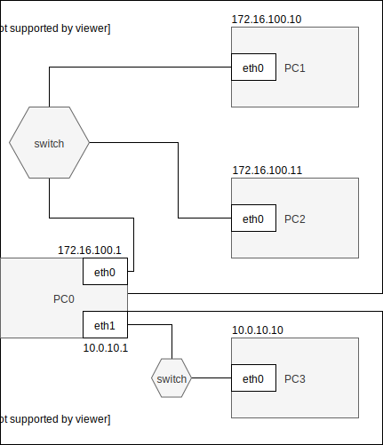
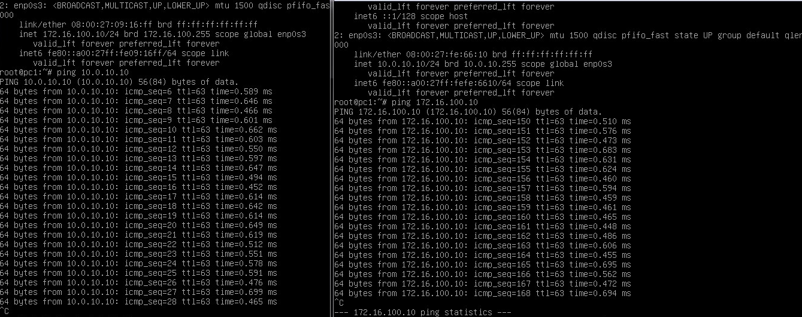

Komendy:
---------
- ip route show
- ip route add default via 10.0.10.1 dev enp0s3
- ip route get 8.8.8.8

- /proc/sys/net/ipv4/ip_forward [przekierowanie: 1-on 2-off]

---
---

Konfiguracja route
------------------

* routing
    * dodaj trasę default
    * dodaj trasę przez bramę
    * dodaj trasę przez interfejs
    * usuń trasę
    * zmień trasę
    * pobierz trasę dla adresu
     
ip 
-------------------------
| subcommand    |  polecenie   | opis  |
| ------------- |:-------------| :---------------| 
|   ``route``    |                               | |
|               |   ``ip route add default via 10.0.10.1 dev enp0s3``             | |
|               |   ``ip route show``             | |
|               |   ``ip route get 10.0.10.1``             | |

Zadanie
------------

1.
   * Przygotuj konfigurację sieci zgodnie z powyższym diagramem, 
   * Przetestuj połączenie pomiędzy wszystkimi elementami sieci
   * Dlaczego połączenie może nie działać
2. Przygotuj konfigurację tak aby została załadowana poprawnie po ponownym uruchomieniu systemu
   * Patrz ``utrwalanie statycznej konfiguracji cwiczenia 2``
   * zwróć uwagę na różnice pomiędzy dydtrybucjami systemu
3. Zainstaluj, uruchom i przetestuj działanie aplikacji ``HTTP_CHAT``
   * aplikacja dostępna w serwisie github ``https://github.com/jkanclerz/http-chat``

Zadanie do domu
---------------

1. Przygotuj konfigurację z zadania 1 wykorzystując inny system operacyjny na komputerze pełniącym rolę routera.
  * debian -> centos lub centos -> debian
  * zapewnij poprawną komunikację pomiędzy PC3 -> PC1

