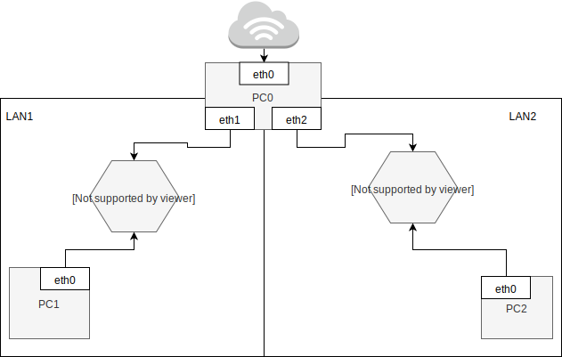
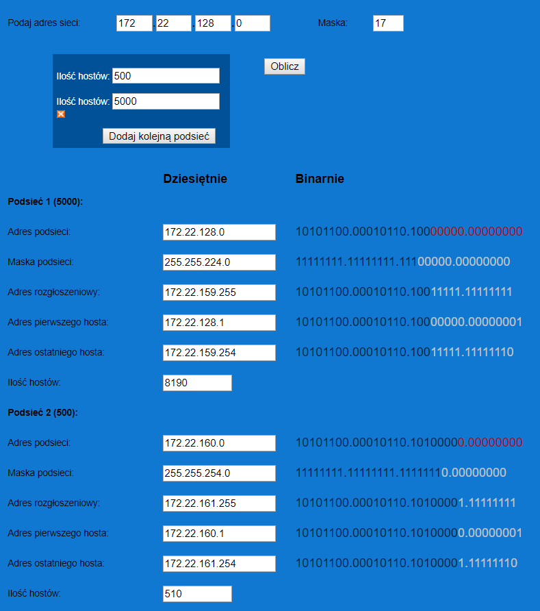

Zadanie 1
---------

1. Zaprojektuj oraz przygotuj prototyp rozwiązania z wykorzystaniem oprogramowania ``VirtualBox`` lub podobnego. 
Zaproponuj rozwiązanie spełniające poniższe wymagania:
   * Usługodawca zapewnia domunikację z siecią internet poprzez interfejs ``eth0`` ``PC0``
   * Zapewnij komunikację z siecią internet na poziomie ``LAN1`` oraz ``LAN2``
   * Dokonaj takiego podziału sieci o adresie ``172.22.128.0/17`` aby w ``LAN1`` można było zaadresować ``500`` adresów natomiast w LAN2 ``5000`` adresów    
   * Przygotuj dokumentację powyższej architektury w formie graficznej w programie ``DIA``
   
Adresacja
---------

Sieci
---------
``LAN1`` - 172.22.160.0/23  
``LAN2`` - 172.22.128.0/19  
 
PC0
---------
``eth0`` - domyślny  
``eth1`` - 172.22.160.1/23  
``eth2`` - 172.22.128.1/19  
 
PC1
---------
``eth0`` - 172.22.160.2/23  
 
PC2
---------
``eth0`` - 172.22.128.2/19   
 
Użyte komendy
---------
Karta do internetu ustawiona jako pierwsza

Podniesienie interfejsu
ip link set dev interfejs up

Nadanie adresu IP danemu interfejsowi sieciowemu
ip addr add adres dev interfejs

Ustawianie gatewaya dla PC1 i PC2, adres = IP PC0, ustawiamy w PC1, PC2
ip route add default via adres 

Włączenie IP forwardigu, ustawiamy w PC0
sysctl -w net.ipv4.ip_forward=1 

Umożliwia udostępnianie internetu dla PC1 i PC2 (ustawiamy w PC0)
iptables -t nat -A POSTROUTING -o interfejs z połączeniem do internetu -j MASQUERADE 

Ustawianie DNSów Googlowskich
pico /etc/resolv.conf - zmiana DNS w PC1 i PC2 na 8.8.8.8 i 8.8.4.4 (domyślne)

ip link set ``nazwa urządzenia`` up - Służy do podniesienia urządzenia 
ip addr add ``adres`` dev ``nazwa urządzenia`` - Dodanie adresu do urządzenia  
ip route add default via ``adres`` - Ustawienie 'defaultowego' gatewaya dla PC0 i PC1  
sysctl net.ipv4.ip_forward=``1`` - Włączene IP forwardigu, który umożliwi komunikację PC1 <-> PC2  
iptables -t nat -A POSTROUTING -o ``nazwa urządzenia`` -j MASQUERADE - Umożliwi udostępnianie internetu dla PC1 i PC2  
pico /etc/resolv.conf - zmiana DNS na ``8.8.8.8`` i ``8.8.4.4`` (sugerowane przez Google)  

 
